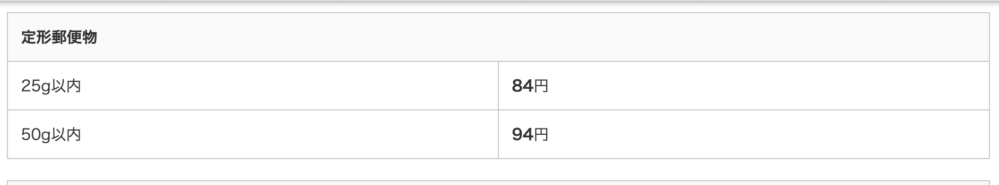

# 事務関連マニュアル
## 休日出勤について
テキストテ**キストテ**キストテキストテキストテキストテキストテキストテキスト

テキスト
## 経費の精算について
主な摘要項目は次の通りです。
- 資料代
- 通信費
- 消耗品

|摘要  |内容
|--|--
|資料代  |書籍代 有料アプリ
|通信費  |切手 宅配便料金
|消耗品費|文具 台所用品

## 宅配便の発送についkて
## 電話、来客対応について
## ごみ収集について
## プリンタについて
## 大容量データの送受信について